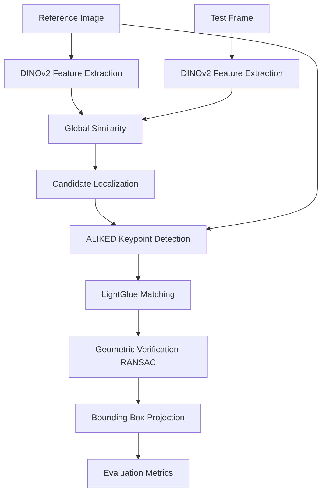

# Pipeline

This document describes the complete target Coarse-to-Fine pipeline for the matching engine.

## Complete Target Pipeline

## Pipeline Stages Explained

1. **DINOv2 Feature Extraction**: Both the reference image and the test frame are passed through a DINOv2 vision transformer to extract dense, high-level semantic features.
2. **Global Similarity**: The extracted feature maps are compared (e.g., via cosine similarity) to identify regions in the test frame most semantically similar to the reference object.
3. **Candidate Localization**: Based on the similarity heatmap, a coarse bounding box (candidate region) is cropped from the test frame, discarding irrelevant background context.
4. **ALIKED Keypoint Detection**: High-quality local keypoints and descriptors are extracted from both the reference image and the cropped candidate region using ALIKED.
5. **LightGlue Matching**: LightGlue matches the ALIKED keypoints between the reference image and the candidate region robustly.
6. **Geometric Verification (RANSAC)**: OpenCV's RANSAC algorithm filters out mismatched keypoints and estimates the geometric transformation (homography) between the objects.
7. **Bounding Box Projection**: The transformation is used to project the reference bounding box onto the candidate region, yielding the final object location.
8. **Evaluation Metrics**: The `MetricsCalculator` compares this final bounding box to the ground truth to calculate IoU and other metrics.
